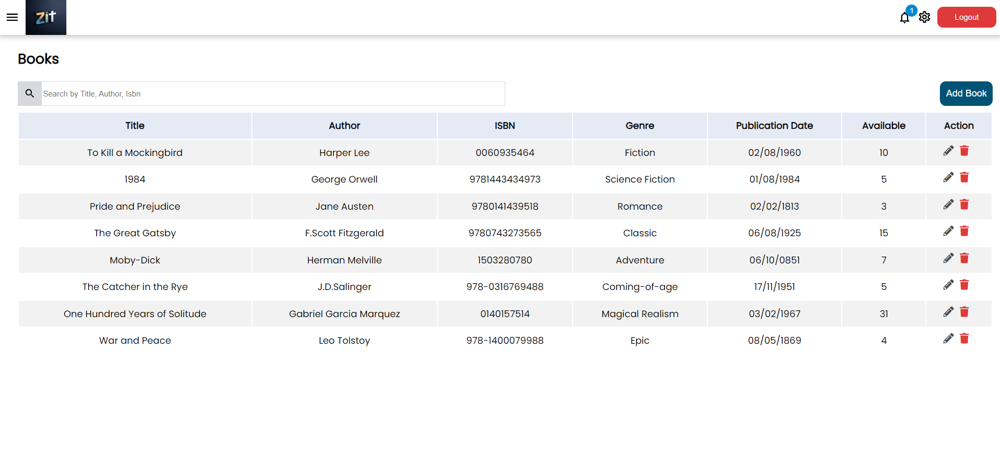

# College Library Management System

## Getting Started
The application typically is used for manage the book in the Library. This application is mainly focused for the user interface and which provides some operations, function etc..

### Prerequisites
- node.js - This project requires Node.js and the version is that as been used is v18.12.1 . (`https://nodejs.org/en/`)
-  Database
		- Atlas - `mongodb+srv://<username>:<password>.vipoq7o.mongodb.net/?retryWrites=true&w=majority&appName=Cluster0`
	
## Development server
**Front-end **
Changing the directory `cd client`
Run `npm install` to install required packages.
Run `npm start` for a dev server.
Navigate to `http://localhost:3000/` for client side.

**Back-end **
Changing the directory `cd server`
Run `npm install` to install required packages.
Run `npm start` for a dev server.

## Login credentials
 **For Admin Login**
`Email` : admin@zit.com
`Passowrd` : Zit@2@4@

 **For Member Login**
`Email` : testuser@gmail.com
`Passowrd`: Zit@1234

## User Flow

### Admin

 **Authentication**
  `Sign In`
  
  
 - Admin can  signin the application using  Admin credentials.
`Change Password`

  
 - Admin can change the password for their convience.

**Dashboard**

  
 - Admin can overlook the count of total books, borrowed books, over-due
   books and return books.  
 - Admin can able to know the information about login details.
 - Admin can able to see the size chart for the folllowing
   total, borrowed,over due and retun books.
   
**Book List**

  
 - Admin can add new book and for input book details (title, author, ISBN, genre, publication date, copies available).
 - The book can update or modify book details and can update the stock for the book information.
 - It can be delete from the Library
 - Admin can able to search the book title author, genre etc...
 
 **Book Details**

  
`Adding New Book`
 - The admin can able to add the new book with required details to add.
`Edit Book`
 - The admin can able to edit the existing book with the respective details and admin can able to update the count of the book.

 **Member Details**

   
 - Admin can able to add the member for the book library.

**Issue Books**

   
 - Admin can able to see list of issued book and the details like member id,name,title,issue date, due date, etc...

**Request Books**

   
  - Admin can able to approve or reject the requested book.
  - Admin can able to see list of issued book and the details like member id,name,title,issue date, due date, etc...

**Settings**
`Genre`

   
 - In this page, Add, edit and delete operation of Genre of the books can be handled easily which is used for Books categorization.

## Member

 **Authentication**
  `Sign In`
 - Member can signin the application using member credentials.
 - The default password for member is Zit@1234.
 - If the member create new email id for login then defalut password is automatically generated and the password is Zit@1234.
`Change Password`
 - Member can able to change the password.

**Dashboard**

   
 - Member can overlook the count of  borrowed books, over-due
   books and return books.  
 - Member can able to see 5 books which added recently. The book details are been showed if the member want to see it.
 - Quick search can be done for finding the books list.
 - Member can able to know the login details.

**Book List**

   
 - Member can able to view the book details and can be request for the book or can able to cancel the request. 
 - Which can able to see the availability of the book.

**Book Details**

   
 - Member can be request for the book or can able to cancel the request. 
 - Which can able to see the availability of the book and member can able to view the book details.

**Borrowing History**

   
 - Member can able to see the list of books which are been purchased.
 - Which can able to retun the book and member can be view the book details which is returned also.

